# VoyageAI - AI Trip Generator 🌍✈️

  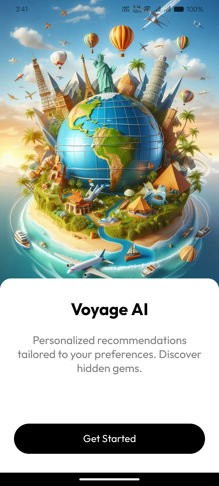

VoyageAI is an intelligent travel companion that leverages AI to create personalized trip itineraries. Using Gemini LLM and modern mobile technologies, it revolutionizes how travelers plan their adventures.

## ✨ Features

- 🤖 **AI-Powered Planning**: Intelligent itinerary generation using Gemini LLM
- 🎯 **Personalized Recommendations**: Tailored suggestions based on user preferences
- 📍 **Location Intelligence**: Integrated with Google Places API for accurate location data
- 🔐 **Secure Authentication**: Firebase-powered user management
- 📱 **Cross-Platform**: Built with React Native and Expo

## 📱 App Screenshots

- **Sign In/Up Screens:**

  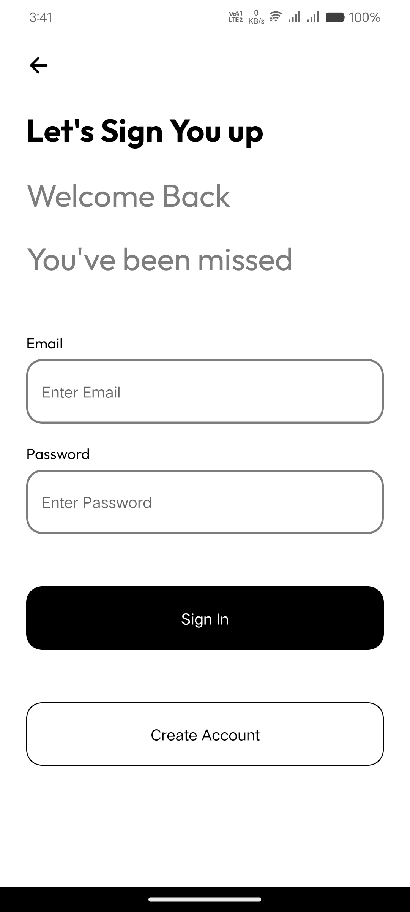
  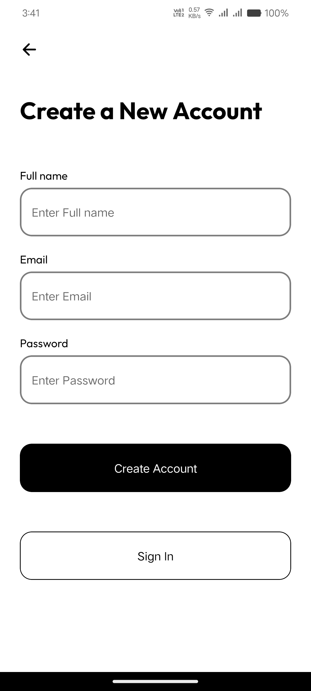

- **Tabs:**

  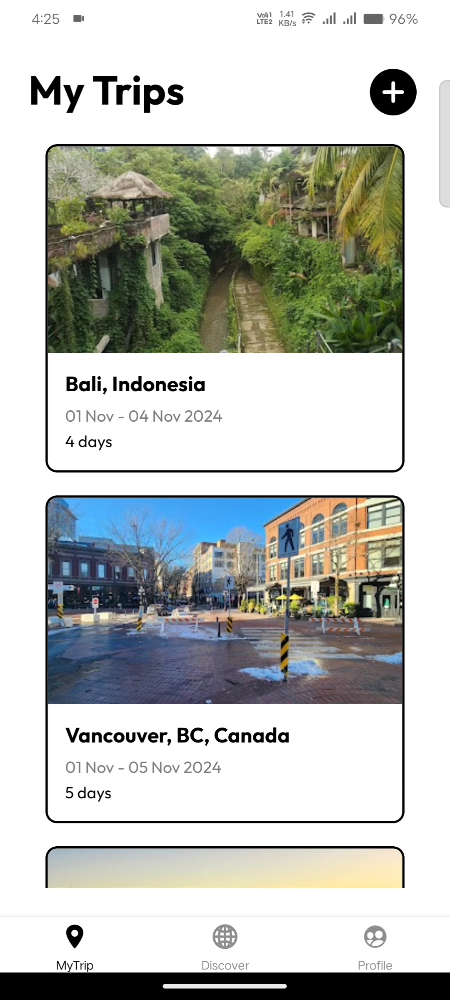
  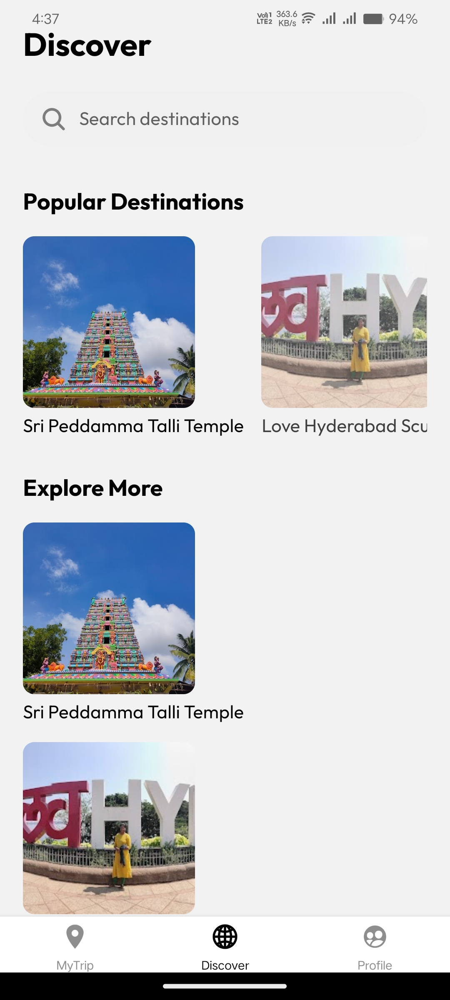
  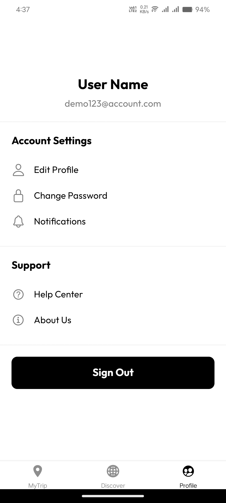

- **Trip Generation:**

  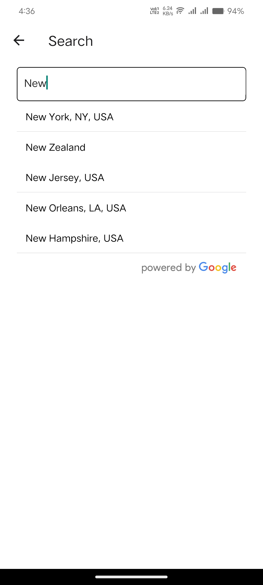
  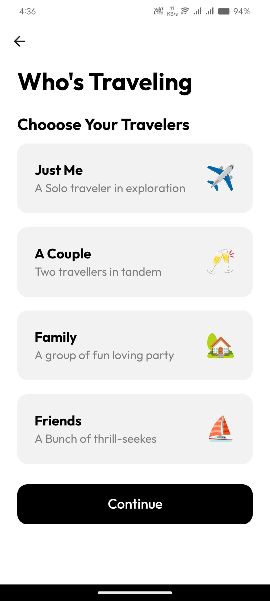
  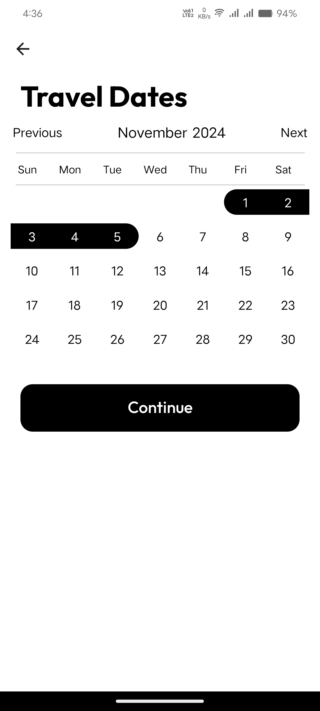
  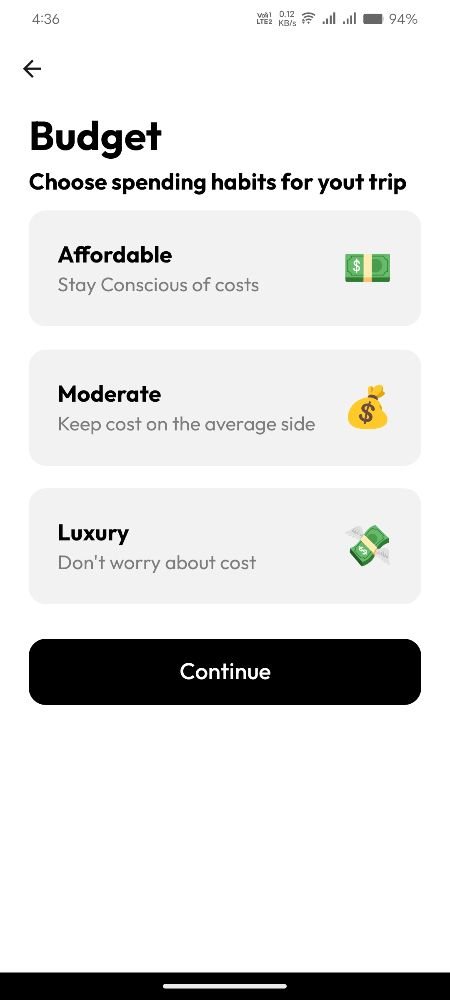
  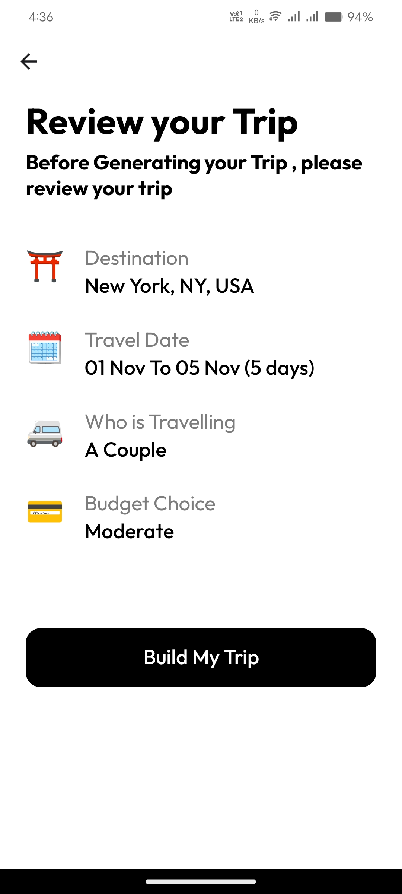
   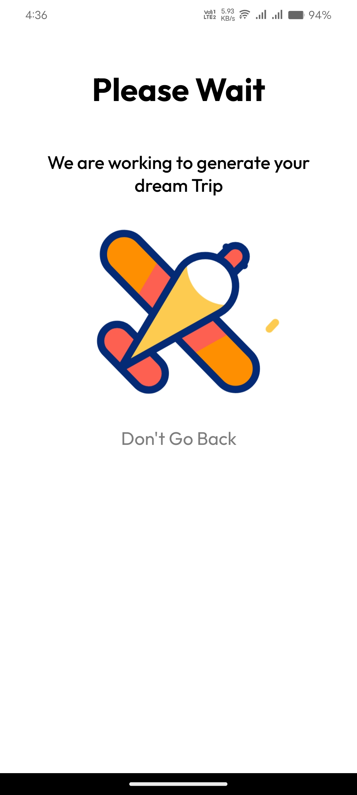

- **Genearted Trip:**

 
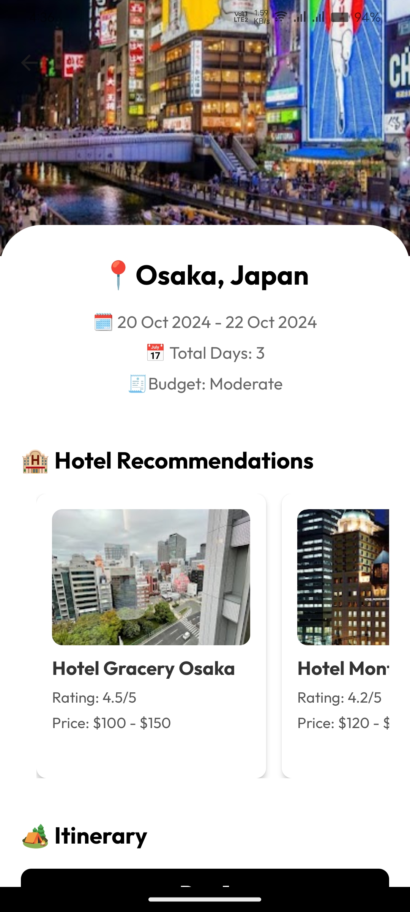

## 🚀 App Flow

1. **Login/Sign Up**
   - Secure authentication through Firebase
   - Easy social login options
   - Quick onboarding process

2. **Home Screen**
   - Clean, intuitive interface
   - Quick access to trip planning
   - View past and upcoming trips

3. **Trip Generation**
   - AI-powered itinerary creation
   - Personalized recommendations
   - Real-time location suggestions

4. **Results & Customization**
   - Detailed trip itineraries
   - Itineraries with suggestions

## 🛠️ Technologies Used

- **Frontend Framework**: React Native
- **Development Platform**: Expo
- **AI Integration**: Gemini LLM
- **Backend & Auth**: Firebase
- **Location Services**: Google Places API
- **State Management**: Custom hooks and context
- **UI Components**: Custom styled components

## 📲 Installation

1. Download the APK from our [landing page]()
2. Enable installation from unknown sources in your Android settings
3. Install and launch VoyageAI

